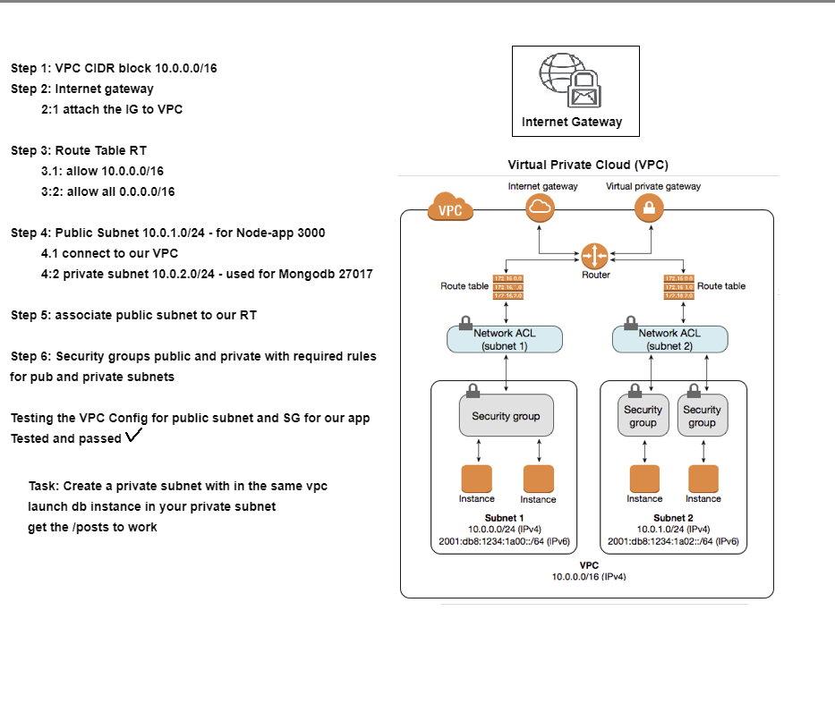

# Cloud_Computing_Bootcamp
## AWS Background
### AWS Global Infrastructure
#### AWS Regions
#### AWS Availability Zones
#### Advantages of Cloud Computing

### Public Cloud, Private Cloud and Hybrid Cloud Use Cases
- Infrastructure As Service (Iaas)
- Platform As Service (Paas)
- Software As Service (Saas)
- Cloud Data Centers

## AWS Services
- Elastic Compute Service `EC2`
- Simple Storage Service `S3`
- Virtual Private Network `VPC`
- Internet Gateway `IG`
- Route Tables `RT`
- Subnet `sn`
- Network Access Control `NACL`
- Security Groups `SG`
- Cloudwatch `CW`
- Simple Notification Service `SNS`
- Simple Queue Service `SQS`
- Load Balancers `LB` - `ALB` - `ELB` - `NLB`
- Autoscaling Groups `ASG`
- Amazon Machine Image `AMI`
- DynamoDB - MongoDB

## EC2
### Setting Up An EC2 Instance
- First Choose the `AMI` you would like for you instance, this will be the OS that it runs on. In this case it will be ubuntu 16.04
- Next choose the instance type, this is dependent on how much memory, storage, network capacity and cpus that you require. Generally the default option is fine
- Most storage is EBS only, which is Elastic Block Storage but some use SSDs.
- Next is configuring your instance details

### After Launching the Instance
- Connect to the instance via SSH on port 22
- If you are having problems connecting here is some debugging code that might help
```
eval ssh-agent

ssh-add "keyfile.pem"
```
- Update and upgrade system
- Install nginx with `sudo apt install nginx -y`
- nginx restart and enable
```
sudo systemctl restart nginx
sudo systemctl enable nginx
```
- check the public ip to ensure nginx is running on your browser
- install node correct version, which for this is an version 6.x
```
curl -sL https://deb.nodesource.com/setup_6.x | sudo -E bash -
sudo apt-get install python-software-properties
sudo apt-get install -y nodejs
```
- install pm2 for this version of node using `sudo npm install pm2@^3 -g`
- it may not work in which case npm module is not installed, in which case run `sudo apt install npm -y`
- `app code` currently available on `localhost`, so need to be copied to the db
- you can clone a github repo with everything directly onto the machine or use the secure copy command `scp`
- I used scp with `scp -i keyfile.pem -r path/file or directory user@ipaddressofinstance:destinationlocation`
- for scp you might think to use root for the user but in the case of ubuntu, use ubuntu in its place to go in as a root user
- now once you have copied the app code accross, the nginx needs to be configured
- this can be done through scp the configuration file across or writing it into the ssh terminal
- for scp use the same command then either link the file or delete the original and replace it
- for linking use `sudo ln -s path/default /etc/nginx/sites-available/default`
- for replacing do
```
sudo rm /etc/nginx/sites-available/default
sudo cp path/default /etc/nginx/sites-available
```
- the restart and enable nginx again, with the commands used earlier
- then navigate back to your app folder then run `npm install` to get the node modules
- finally `npm start` to start the app and connect on your web browser to check it is working

#### Setting up a db instance
- Follow the steps given for setting up the instance for the app
- Except for the security group do not allow ports 80 and 3000 as they do nothing the db requires
- Instead open port 27017 for the public ip from your app instance
#### Configuring the db
- ssh into the db using the same method as before but change the ip
- first get the key and correct version of MongoDB
```
sudo apt-key adv --keyserver hkp://keyserver.ubuntu.com:80 --recv D68FA50FEA312927
echo "deb https://repo.mongodb.org/apt/ubuntu xenial/mongodb-org/3.2 multiverse" | sudo tee /etc/apt/sources.list.d/mongodb-org-3.2.list
```
- then run the update and upgrade commands as used earlier
- install the version of mongodb required for the app with
```
sudo apt-get install -y mongodb-org=3.2.20 mongodb-org-server=3.2.20 mongodb-org-shell=3.2.20 mongodb-org-mongos=3.2.20 mongodb-org-tools=3.2.20
```
- then restart and enable MongoDB
```
sudo systemctl restart mongod
sudo systemctl enable mongod
```
- then similar to in the app instance, you can scp across the `mongod.conf` file and replace or link the file or just edit the `mongod.conf` already present
- editing it the easier option just `cd /etc` then `sudo nano mangod.conf`, all you need to change is the line with `127.0.0.1` to either `0.0.0.0` or the ip address of your app instance
- then restart and enable MongoDB again as was done earlier
#### Connecting the app to the DB
- ssh back into your app instance
- in order to for the app to connect to the db, you need to set up the environment variable
- this can be done manually everytime which is inconvenient or my running a couple of lines of code that add it permanently
```
sudo echo 'export DB_HOST="mongodb://ipofdb:27017/posts"' >> .bashrc
source ~/.bashrc
```
- then the database needs to be seeded using `path/seed.js`
- now you can start the app up again and it will connect to the db

## Replications through AMIs
- from any instance you can creature a duplicate machine image called an `AMI`
- this allows you to easily replicate a preconfigured instance and allows you to return to an earlier point if something goes wrong
- basically the save game of AWS
- to do it, select the instance you want to make an AMI from and go to actions
- then got to images and templates then select create image
- you can give it a name, and change a few setting then you can create your image
- any programs currently running on your instance when it is made into an AMI will also be running when you start your new instance with your AMI

## Monitoring
### 4 Golden Signals
- Latency: Time to complete request
- Traffic: Measure of Demand
- Errors: Services Failing
- Saturation: How Full is the service

### Basic Monitoring on AWS
- Select an instance and select Monitoring for that instance, you can enable detailed Monitoring from here
- This will show a variety of useful information such as CPU usage
- This can then be added to an information dashboard, detailed Monitoring does cost extra on AWS
- You can add alarms to monitored instance for when specific criteria are exceeded or change to an unexpected value
- This can be done quickly through pressing the `+` in the alarm status column or in the alarms section of the Cloudwatch area
- If done through the Cloudwatch area the alarm is not for a specific instance until it is assigned
- Once your first alarm is created you can create an sns group for it so when the alarm triggers you receive a notifcation through your desired means such as email
- When you add an SNS group to an alarm you will need to confirm the subscription to it

### Automation of Monitoring Response
- Application Load Balancer (ALB)
- Auto Scaling Group
- Launch Template Config - how many instances at all times
- 2 instances - min=2 max=3
- Policies of scaling out and scaling in to minimum

#### Scaling on Demand
- Scaling up vs Scaling out
- Scaling up - increases the size of your instance
- Scaling Out - increases the number of instances

## Creating an Auto Scaling Group
- Before beginning make sure to create the AMIs you need for your ASG so you can create a launch template with them
### Launch Templates
- First assign a name to your template, using the standard naming convention
- Tick the tickbox about setting a template for an ec2 instance just to ensure nothing is missed
- Add a template tag for the name
- Choose the AMI you have prepared for the template
- Then assign the instance type, generally the standard t2.micro is good
- Next assign a security group to it, this doesn't actually have to be assigned here depends how you are doing your VPC's and such
- Then go into advanced details, scroll to the bottom and add to the user data any commands you wish the instance to run as part of its start up
- This is useful if you want to install modules or start an application
- Then move onto creation of the Auto Scaling Group itself
### Configuring the ASG
- Like the launch template, first thing is to assign a name to your ASG
- Then select launch template for it that we made in the previous section
- It asks to select a VPC, if this is going to be a part of an existing VPC group then select that one otherwise just leave the default one it has made
- For the Availability zones, select the ones you think are appropriate but that will most likely be eu-west-1 a, b and c
- Move onto the next section and assign a load balancer, you can use an existing one but is probably better to just create a new one
- Select HTTP/HTTPS or the application load balancer
- It should generate a name for itself but you can change it if you like
- App is most likely internet facing so select that option next
- For listeners and routing, add a new dault routing group which should generate an automatic name but this can be changed like before
- For health checks enable ELB and set it to check the instance health for an appropriate amount of time, the standard 5 minutes should be fine
- Select the last tickbox so group metrics are enabled with Cloudwatch
- Next is group sizes, where you can set minimum, maximum and desired numbers of instances running, for this app i set at min and desired at 2 and 3 for max
- The scaling policy now needs to be decide, this is the condition that must be met for the ASG to start up a new instance
- Generally CPU utilization is the easiest category to set, choose a value for it that should be desirable for your instances
- Next onto notifcations from the ASG, so you can either assign a premade SNS group or you can create a new topic
- Then is tags which should be fine, if you want to add anything then do
- Finally review everything to ensure it is correct, then create the group
- This will auto launch the minimum instances to get your app working


## S3
- Amazon Simple Storage
#### commands
- `aws s3 ls` to list all buckets
- `aws --version`
- `aws configure` add keys and configure
- `aws s3 mb s3://name-of-bucket --region name`
- `aws s3 cp s3://name-of-bucket file` to copy a file or contents of bucket
- `aws s3 rm s3://name-of-bucket --recursive` delete all files from bucket remove recursive to target specific files
- `aws s3 rb s3://name-of-bucket` delete bucket, needs to be empty
- `aws s3 sync s3://name-of-bucket syncfolder` make a folder that all files automatically sync to specific bucket

### AWSCLI
- AWSCLI can be used to create any AWS resource required



# VPC
- Step 1: VPC CIDR block 10.105.0.0/16

- Step 2: Internet Gateway
- Step 2.1 - attach the IG to VPC

- Step 3: Route Table RT
- Step 3.1 - allow 10.105.0.0/16
- Step 3.2 - allows all 0.0.0.0/16

- Step 4: Public Subnet 10.105.1.0/24
- Step 4.1 - connect to VPC
- Step 4.2 - Private Subnet 10.105.2.0/24 - used for Mongodb 27017

- Step 5: associate public subnet to our RT

- Step 6: Security groups public and private with required rules for public and private subnet

- Step 7:
